# Deep Learning Classification System using PHP and Keras
By: **Hossam M. Balaha**
 
C.V.: http://bit.ly/2wAZ2nI

## Project Description
This project aims to create an interface between PHP (Web) and Python.
The website is developed using HTML, CSS, JavaScript, Bootstrap, jQuery and PHP.
You can add a classifier by using the HDF5 exported file from Keras (TensorFlow) and 
labels file (a text a file where each label in put in a single line).
After that, you can use that classifier record to perform different classification.
The current progress is performed on images.

## Project Tutorial
You can follow the following steps to be able to understand the project.

(1) When you surf the website, you can find the following:

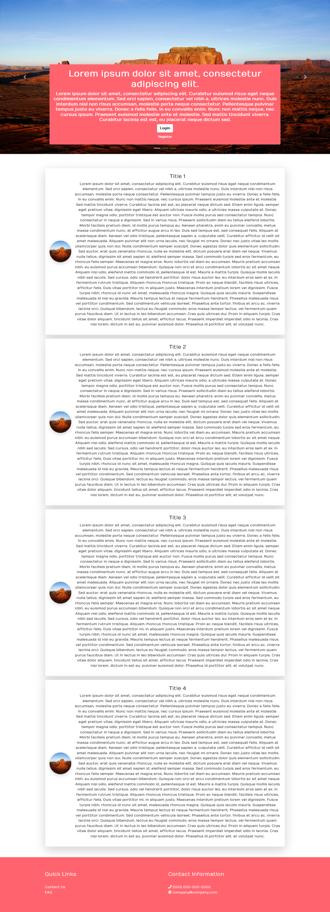

You can change the configurations such as website name, slider info, footer info 
and cards info from the database tables named: `website_configuations`,
 `website_cards` and `website_slider`.

(2) You need to create an account. You can register from the `Register` button 
in the slider.

You need to enter the required fields: `First Name`, `Username`, `Email`, 
`Password`, and `Retype Password`.

(3) If you created the account successfully, a success message will be displayed 
and you will be redirected to the login webpage as shown in the following figure.

(4) You need to login with the `Username` and `Password`.

(5) You will be redirected to your `Dashboard` after your success login as shown
in the following figure.

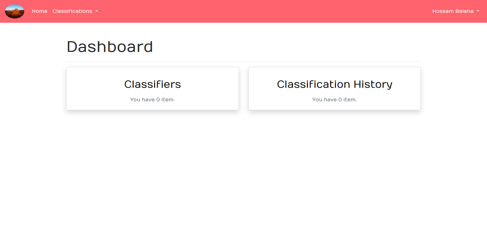

(6) You can add a classifier and check your classifiers from the
`Classifiers` card and you can check your classification history from 
the `Classification History` card as shown in the following two figures.

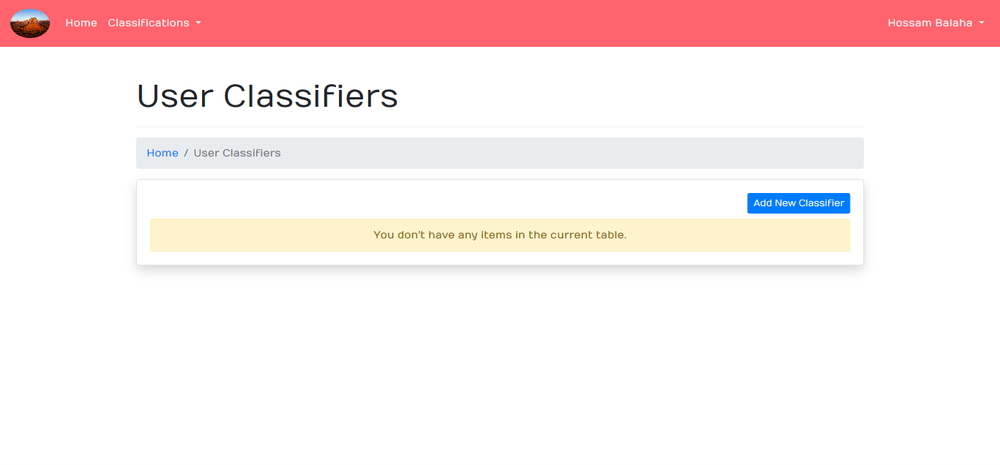

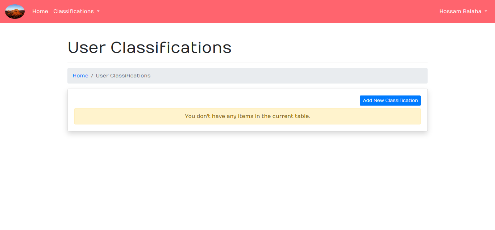

(7) You can add a new classifier from the `Add New Classifier` button in the
`Classifiers` card or from the drop down menu in the navigation bar
as shown in the following figure.

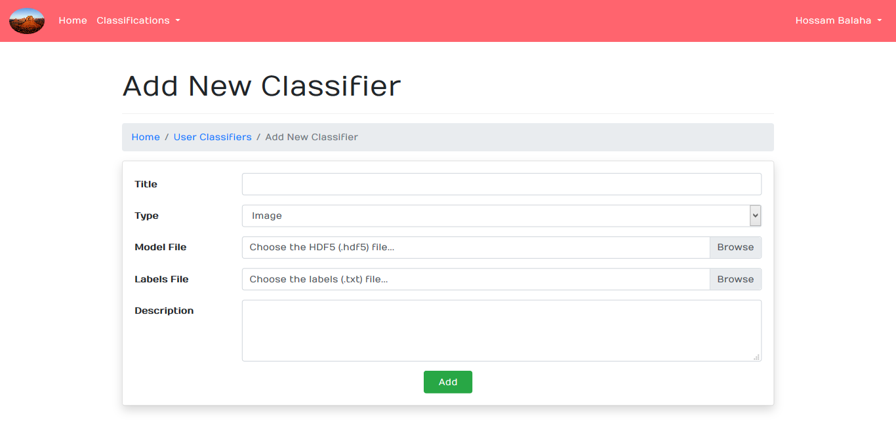

(8) You need to fill in the the required fields: `Title`, `Type`, `Model File`
and `Labels File`. The `Title` field is the nickname of your classifier.
The `Type` field is the type of input data (currently only images are available).
The `Model File` must be the model file with an extension of `hdf5`.
The `Labels File` must be a text file with an extension of `txt`. The labels must
be ordered in the same order used in the training process. The following figure shows
a sample filling of the fields.

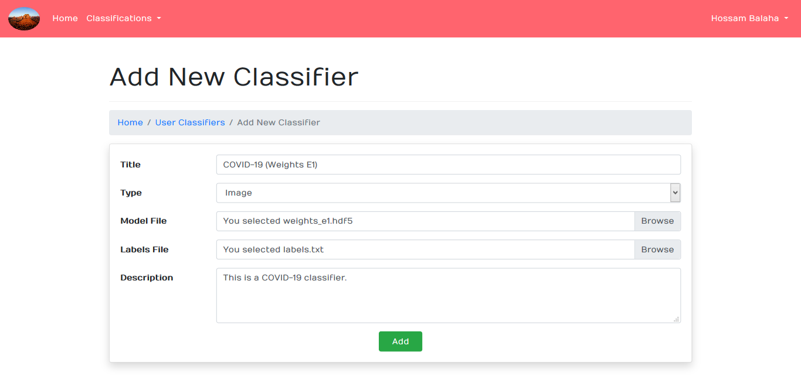

(9) The classifier will be added as shown in the following figure.

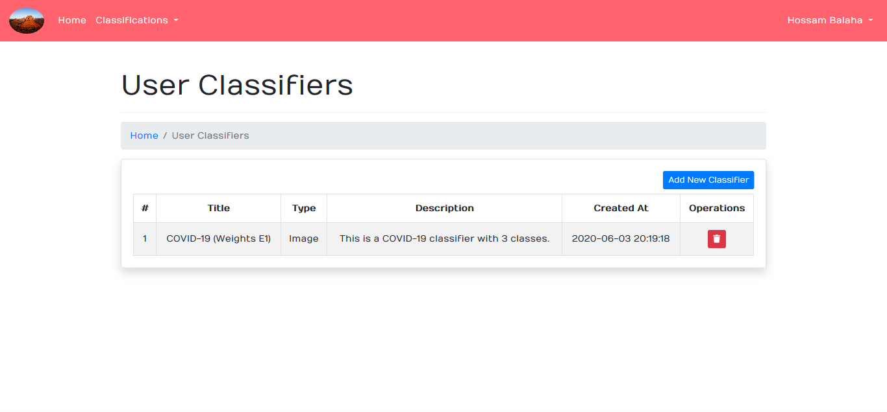

You can delete it from the delete button (shown in red in the last column: `Operations`).

(10) You can add a new classification from the `Add New Classification` button in the
`Classifications` card or from the drop down menu in the navigation bar
as shown in the following figure.

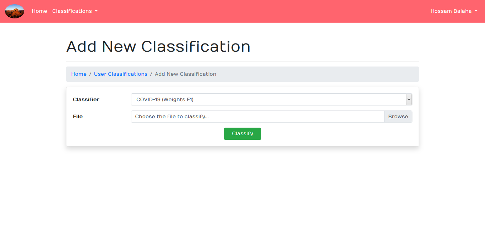

(11) You need to select a `Classifier` and `File`. For example:

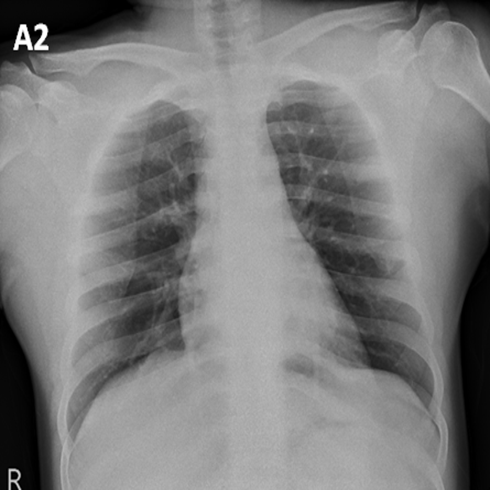

This image is for a patient with a `COVID-19`. It is just used as an example.
The classification process may take a while according to your computer (server) speed
and model complexity.

(12) The results are shown in the table in the `Classifications History` card
as shown in the following figure.

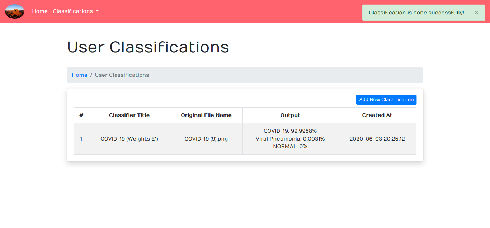

The record shows the output of the first three predictions 
(in percentages with four decimals)
in case of you have more than three classes (labels). 
In our example, it showed that:
`COVID-19: 99.9968% Viral Pneumonia: 0.0031% NORMAL: 0%`

## Database Design
The database is designed in SQL using MySQL DBMS. The design is shown
in the following figure.

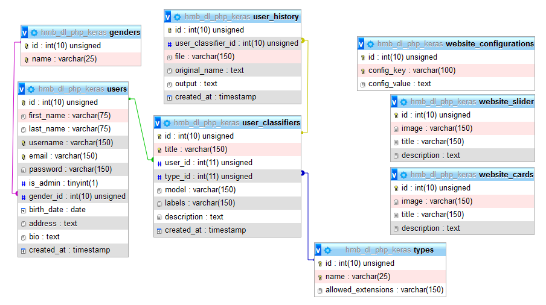

## Project Repo. on GitHub
**Link**: https://github.com/HossamBalaha/Deep-Learning-Classification-System-using-PHP-and-Keras

## Copyright
All rights reserved. No part of this publication may be reproduced, distributed or 
transmitted in any form or by any means, including photocopying, recording or other 
electronic or mechanical methods, without the prior written permission of me, except in 
the case of brief quotations embodied in critical reviews and certain other non-
commercial uses permitted by copyright law. For permission requests, write to the 
publisher at the address below.
Email: `h3ossam@gmail.com`

